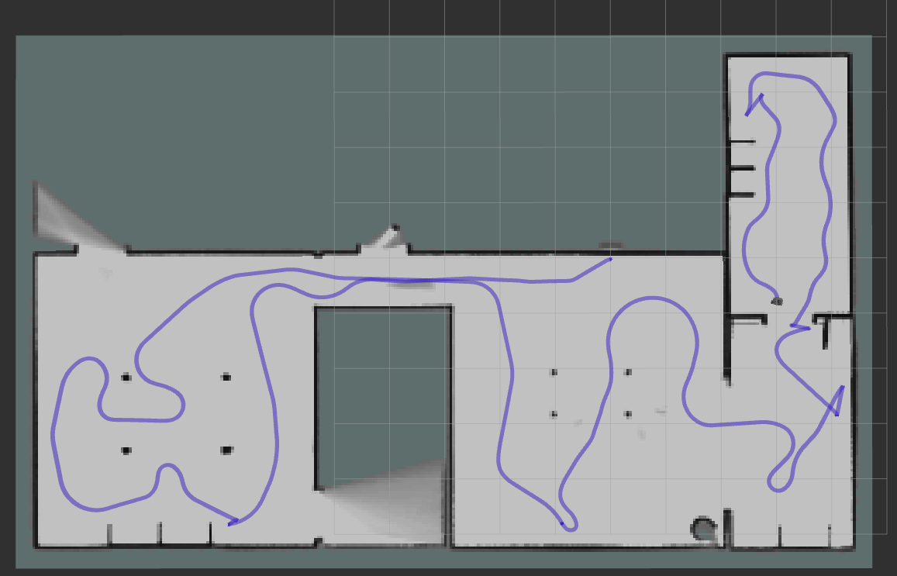

# launch gazebo and robot

default parameters are `world_name == house [house, dqn_stage[1, 2, 3, 4], world]`, `model == burger [burger, waffle]` , `robot_namespace == burger1`.

```bash
ros2 launch turtlebot3_multi_nav sim.launch.xml (model:=... robot_namespace:=...)
```

## launch each robot

```bash
ros2 launch turtlebot3_multi_nav bringup_robot.launch.py
```

## teleop

```bash
ros2 run turtlebot3_multi_nav teleop_keyborad.py --ros-args -p robot_namespace:=burger1
```


